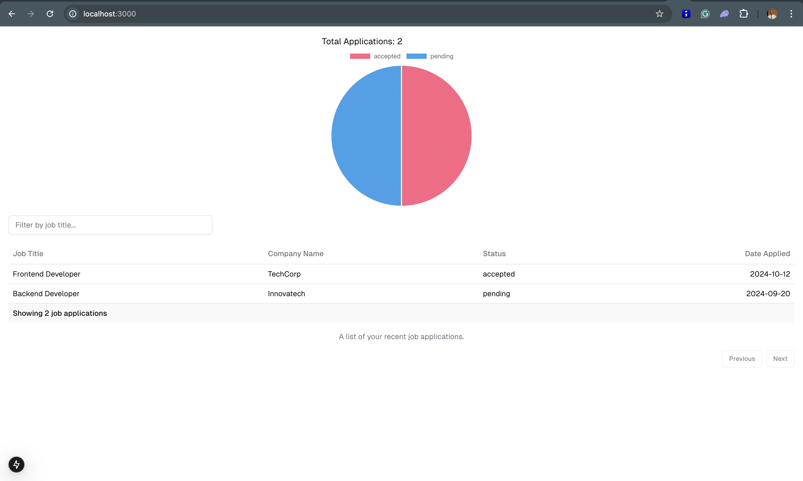
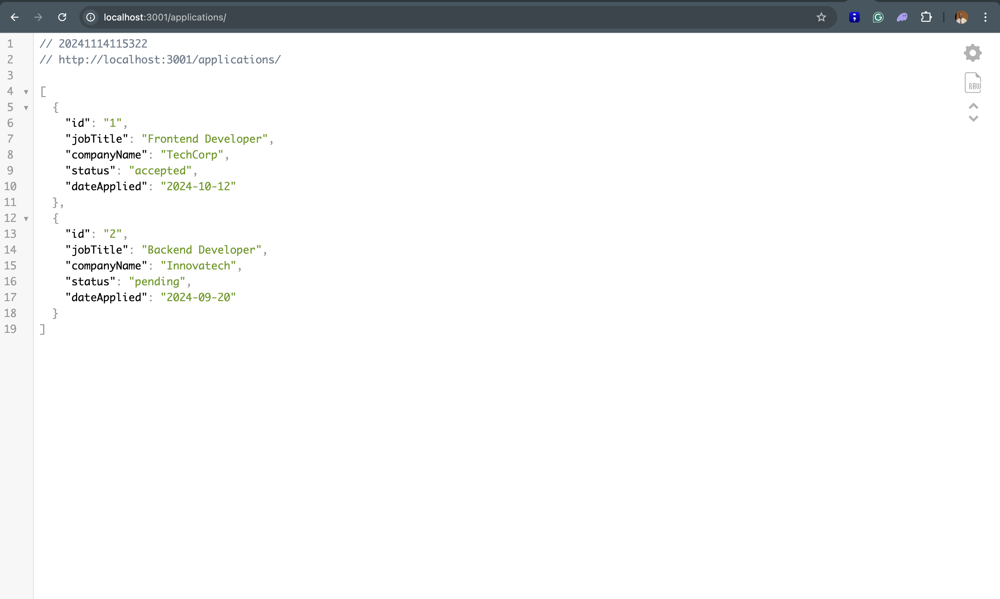
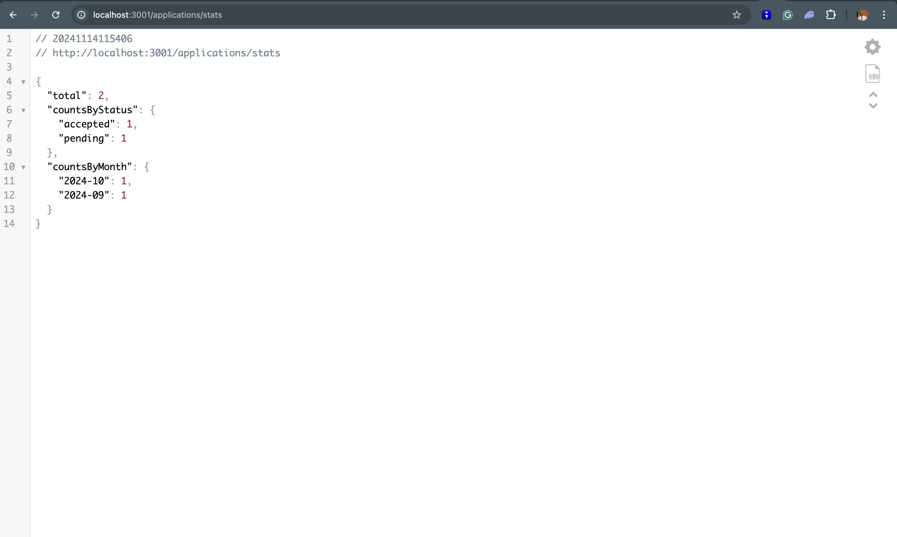

# Job Application Dashboard

This project is a full-stack Job Application Dashboard with a frontend built using Next.js and a backend using Nest.js. The frontend displays job application data with analytics using a chart, and the backend provides APIs to manage and retrieve job application data.

## Prerequisites

- [Docker](https://docs.docker.com/get-docker/) installed.
- [Docker Compose](https://docs.docker.com/compose/install/) installed.

## How to Run the Project

To start the project, follow these steps:

1. Clone the repository:

   ```bash
   git clone https://github.com/kalio007/uri
   cd uri
   ```

2. Build and run the project using Docker Compose:

   ```bash
   docker-compose up --build
   ```

   This will:

   - Build and start the frontend and backend containers.
   - The frontend will be accessible at `http://localhost:3000`.
   - The backend API will be accessible at `http://localhost:3001`.

3. To stop the services:

   ```bash
   docker-compose down
   ```

## Accessing the Application

- **Frontend**: [http://localhost:3000](http://localhost:3000)
- **Backend API**: [http://localhost:3001](http://localhost:3001)




